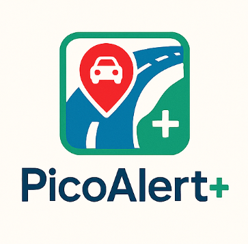

# PicoAlert+ - Tu Aliado contra el Pico y Placa



PicoAlert+ es una aplicación web diseñada para ayudar a los conductores a mantenerse informados sobre las restricciones de Pico y Placa en Bogotá, evitando multas y facilitando la planificación de viajes.

## 🚀 Características Principales

- **Notificaciones en Tiempo Real**: Recibe alertas instantáneas sobre las restricciones de Pico y Placa para tu vehículo.
- **Calendario Interactivo**: Consulta el Pico y Placa para cualquier día y planifica tus viajes con anticipación.
- **Verificación de Placas**: Comprueba rápidamente si tu vehículo puede circular en un momento específico.
- **Interfaz Intuitiva**: Diseño moderno y fácil de usar, adaptado a dispositivos móviles y de escritorio.
- **Modo Oscuro**: Interfaz adaptable que se ajusta a tus preferencias de visualización.

## 🔍 Reglas de Pico y Placa Implementadas

La aplicación implementa las siguientes reglas para determinar si un vehículo puede circular:

1. **Días Pares**: Si el día del mes es par (2, 4, 6, etc.), el pico y placa aplica para las placas terminadas en los dígitos definidos en el endpoint (ID 2).
2. **Días Impares**: Si el día del mes es impar (1, 3, 5, etc.), el pico y placa aplica para las placas terminadas en los dígitos definidos en el endpoint (ID 1).
3. **Fines de Semana**: Los sábados y domingos no hay restricción de circulación.
4. **Horario de Restricción**: Las restricciones aplican de 6:00 AM a 9:00 PM en días hábiles.
5. **Vehículos Exentos**: Algunos vehículos pueden estar exentos de las restricciones (servicios públicos, emergencias, etc.).

Las reglas específicas de los dígitos restringidos se obtienen dinámicamente desde un endpoint, lo que permite actualizar las restricciones sin necesidad de modificar el código.

## 💻 Tecnologías Utilizadas

- **[Astro](https://astro.build/)**: Framework web para crear sitios estáticos de alto rendimiento
- **[Tailwind CSS](https://tailwindcss.com/)**: Framework CSS para diseño rápido y responsivo
- **[Svelte](https://svelte.dev/)**: Framework para componentes interactivos
- **[Flowbite](https://flowbite.com/)**: Biblioteca de componentes UI basada en Tailwind
- **[Vercel](https://vercel.com/)**: Plataforma para despliegue y hosting

## 🧞 Comandos

Todos los comandos se ejecutan desde la raíz del proyecto, desde una terminal:

| Comando                   | Acción                                           |
| :------------------------ | :----------------------------------------------- |
| `npm install`             | Instala dependencias                            |
| `npm run dev`             | Inicia servidor local en `localhost:4321`       |
| `npm run build`           | Construye el sitio para producción en `./dist/` |
| `npm run preview`         | Previsualiza la build antes de desplegar        |
| `npm run astro ...`       | Ejecuta comandos CLI como `astro add`, `astro check` |

## 🚀 Despliegue en Vercel

Para desplegar este proyecto en Vercel, sigue estos pasos:

1. **Instala el adaptador de Vercel para Astro:**
   ```bash
   npm install @astrojs/vercel
   ```

2. **Configura `astro.config.mjs`:**
   Asegúrate de que tu archivo `astro.config.mjs` esté configurado para usar el adaptador de Vercel.

3. **Despliega en Vercel:**
   * Asegúrate de que tu proyecto esté en un repositorio de Git (GitHub, GitLab, Bitbucket).
   * Ve a tu [Vercel Dashboard](https://vercel.com/dashboard).
   * Haz clic en "Add New..." -> "Project".
   * Importa tu repositorio de Git.

## 📁 Estructura del Proyecto

```
/
├── public/              # Archivos estáticos (imágenes, estilos globales)
├── src/
│   ├── components/      # Componentes reutilizables
│   │   ├── PicoPlacaStatus.astro  # Componente para mostrar estado de Pico y Placa
│   │   └── ...
│   ├── layout/          # Layouts de la aplicación
│   ├── lib/             # Lógica de negocio y utilidades
│   │   ├── pico-y-placa.js  # Implementación de reglas de Pico y Placa
│   │   └── ...
│   ├── pages/           # Páginas de la aplicación
│   │   ├── user/        # Páginas para usuarios registrados
│   │   │   └── calendar.astro  # Calendario interactivo de Pico y Placa
│   │   └── ...
│   └── styles/          # Estilos adicionales
└── package.json         # Dependencias y scripts
```

## 👥 Contribución

Las contribuciones son bienvenidas. Por favor, sigue estos pasos:

1. Haz fork del repositorio
2. Crea una rama para tu característica (`git checkout -b feature/amazing-feature`)
3. Haz commit de tus cambios (`git commit -m 'Add some amazing feature'`)
4. Haz push a la rama (`git push origin feature/amazing-feature`)
5. Abre un Pull Request

## 📝 Licencia

Este proyecto está bajo la Licencia MIT. Consulta el archivo `LICENSE` para más detalles.

---

Desarrollado con ❤️ para ayudar a los conductores de Bogotá.